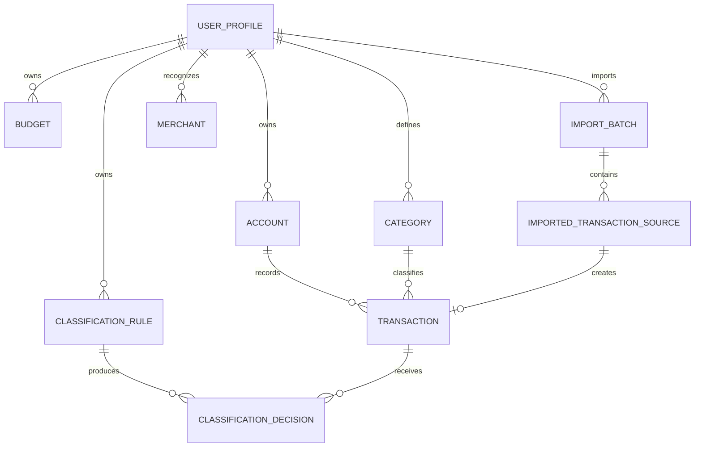

# LXCell Data Model

Last updated: 2026-08-17

## Purpose

This document defines the first normalized accounting data model for LXCell. It is a design document, not an implementation contract frozen forever. The goal is to establish the core entities, relationships, and audit rules before writing the SQLite schema and Python domain layer.

LXCell should move away from the current spreadsheet shape, where one day is a row and categories are columns. The application should store one financial movement as one transaction, with enough metadata to trace where it came from, how it was classified, and whether the user reviewed it.

## Design Principles

- The database is the long-term source of truth.
- Historical Excel workbooks are read-only import and validation sources.
- Every imported transaction must be traceable to its source file, import batch, source row, and original raw values where practical.
- Classification must be explicit, reviewable, and reversible.
- Deterministic rules should be preferred before AI suggestions.
- Ambiguous transactions should remain pending review.
- User profiles must keep data isolated.
- Money should be stored as integer minor units, such as cents, to avoid floating point drift.
- Dates should be stored as ISO calendar dates unless a bank source provides a meaningful timestamp.
- Deletions of financial records should normally be soft deletes or reversals, not destructive deletes.

## Persistence Direction

Initial persistence target: SQLite.

Rationale:

- Local and free.
- Easy to back up.
- Reliable for personal finance volumes.
- Sufficient for multiple local user profiles.
- Works well with a later Streamlit application.

Accepted implementation:

- Use SQLite as the storage engine.
- Use SQLAlchemy 2.x for the Phase 1 domain schema and repository layer.
- Defer Alembic until the first real schema migration is needed; the initial schema can be created directly from metadata in tests and local development.
- Keep the domain model understandable without requiring UI context.

Status:

- Accepted for Phase 1.

## Entity Overview

## Core Entities

### UserProfile

Represents an isolated financial workspace.

Examples:

- Primary user
- Managed profile
- Sample user

Key fields:

- `id`
- `display_name`
- `default_currency`
- `locale`
- `is_active`
- `created_at`
- `updated_at`

Rules:

- All accounts, categories, budgets, imports, and transactions belong to one user profile.
- Cross-profile data must not be mixed in reports.
- `locale` defaults to `es_ES` unless the profile needs a different display locale.

### Account

Represents a financial account, card, wallet, cash balance, or investment account.

Examples:

- Primary current account
- Shared card account
- Savings account
- Cash
- Investment account

Key fields:

- `id`
- `user_profile_id`
- `name`
- `institution_name`
- `account_type`
- `currency`
- `ownership_type`
- `external_account_ref`
- `is_active`
- `created_at`
- `updated_at`

Suggested `account_type` values:

- `checking`
- `savings`
- `credit_card`
- `cash`
- `investment`
- `loan`
- `mortgage`
- `other`

Suggested `ownership_type` values:

- `personal`
- `shared`
- `managed_for_someone_else`

Rules:

- Transactions should normally belong to exactly one account.
- Transfers between accounts should be represented explicitly instead of being hidden as generic expenses.
- `external_account_ref` should store a stable masked or source-provided account identifier when available, never sensitive full credentials.
- Shared accounts should be represented with `ownership_type = shared` in Phase 1. A separate household/workspace concept can be added later only if it removes real complexity.
- Account names should be unique within a user profile.

### Category

Represents a user-defined classification bucket for transactions.

The 2026 category structure is canonical for future work. Earlier categories should be mapped into this structure where appropriate.

Key fields:

- `id`
- `user_profile_id`
- `name`
- `parent_category_id`
- `category_type`
- `canonical_key`
- `display_order`
- `is_active`
- `created_at`
- `updated_at`

Suggested `category_type` values:

- `expense`
- `income`
- `transfer`
- `saving`
- `investment`
- `debt`
- `adjustment`

Rules:

- Category names may change over time, so imports and reports should rely on stable IDs.
- `canonical_key` can support mappings such as older `Restaurantes` and `Ocio` into a newer `Restaurantes y ocio` category.
- Categories should support hierarchy, but Phase 1 can treat subcategories as optional.
- The public repository must not seed real personal category sets. Tests and examples should use generic categories; real user categories should be created locally or imported from private source material.
- Category names and canonical keys should be unique within a user profile in Phase 1.
- `canonical_key` should normally be generated by the application from the category name, not manually entered by a regular user.

### Merchant

Represents a normalized merchant, counterparty, employer, lender, or payee.

Examples:

- Grocery Store A
- Bank A
- Payroll Provider A
- Insurance Provider A
- Subscription Provider A

Key fields:

- `id`
- `user_profile_id`
- `display_name`
- `normalized_name`
- `merchant_type`
- `default_category_id`
- `created_at`
- `updated_at`

Rules:

- Merchants are optional for manually entered transactions.
- Merchant normalization should help classification rules without overwriting the original bank description.
- A merchant may have a default category, but that default should still produce a traceable classification decision.

### Transaction

Represents one normalized financial movement.

Key fields:

- `id`
- `user_profile_id`
- `account_id`
- `transaction_date`
- `posted_date`
- `description_clean`
- `description_raw`
- `category_id`
- `amount_minor`
- `currency`
- `direction`
- `transaction_type`
- `payment_method`
- `review_status`
- `source_type`
- `source_id`
- `is_duplicate_candidate`
- `is_deleted`
- `created_at`
- `updated_at`

Suggested `direction` values:

- `inflow`
- `outflow`
- `neutral`

Suggested `transaction_type` values:

- `expense`
- `income`
- `transfer`
- `refund`
- `fee`
- `tax`
- `saving`
- `investment`
- `debt_payment`
- `adjustment`

Suggested `review_status` values:

- `pending_review`
- `user_confirmed`
- `ignored`

Suggested `payment_method` values:

- `card`
- `bank_transfer`
- `peer_to_peer`
- `direct_debit`
- `cash`
- `standing_order`
- `other`

Rules:

- Store amounts as signed or directional integer minor units, but be consistent. The recommended Phase 1 approach is:
  - `amount_minor` is always non-negative.
  - `direction` determines inflow/outflow.
- `description_clean` is the normalized human-readable description.
- `description_raw` preserves the source text.
- Qualifiers such as `raw`, `clean`, and `source` should follow the main field concept in column names.
- `category_id` can be null while a transaction is pending review.
- `description_clean` can be null during import, but must be present before a transaction is user-confirmed.
- Any user correction should preserve the previous classification through `ClassificationDecision`.
- Destructive deletion should be avoided; prefer `is_deleted` with audit metadata.
- `user_profile_id` should be stored directly on transactions and kept synchronized with the linked account and category through database constraints.
- `account_id` should remain required. Historical imports without known account provenance should use an explicit unknown historical account for the profile instead of null account references.

### TransactionSplit

Represents a split of one transaction into multiple categories or purposes.

Use cases:

- A supermarket transaction containing both groceries and gifts.
- A shared payment where part belongs to another person.
- A travel payment partly reimbursed later.

Key fields:

- `id`
- `transaction_id`
- `category_id`
- `amount_minor`
- `description`
- `created_at`
- `updated_at`

Rules:

- Phase 1 can postpone implementation, but the data model should reserve the concept.
- If splits exist, reports should use split amounts instead of the parent transaction category.
- Split totals must equal the parent transaction amount.

### TransferLink

Represents a relationship between two transactions that are the two sides of a transfer.

Examples:

- Moving money from one bank account to another.
- Moving money from current account to savings.
- Paying a credit card from a bank account.

Key fields:

- `id`
- `source_transaction_id`
- `destination_transaction_id`
- `confidence`
- `review_status`
- `created_at`
- `updated_at`

Rules:

- Transfers should not count as expenses or income in normal budget reports.
- Automated transfer matching should be reviewable.

## Budgeting Entities

### Budget

Represents a budget plan for a user and period.

Key fields:

- `id`
- `user_profile_id`
- `name`
- `period_type`
- `start_date`
- `end_date`
- `currency`
- `is_active`
- `created_at`
- `updated_at`

Suggested `period_type` values:

- `monthly`
- `annual`

Rules:

- Budgets belong to one user profile.
- Annual budgets can be converted into monthly expectations for reporting.
- `Budget.name` should be unique within a user profile in Phase 1.
- `custom` periods are deferred from Phase 1.

### BudgetLine

Represents a planned amount for a category within a budget.

Key fields:

- `id`
- `budget_id`
- `category_id`
- `amount_minor`
- `rollover_policy`
- `notes`
- `created_at`
- `updated_at`

Suggested `rollover_policy` values:

- `none`

Rules:

- Keep `rollover_policy` in the Phase 1 schema, but leave concrete policies beyond `none` for later design.
- Phase 1 behavior can support `none` only.
- `BudgetLine` should be unique by `budget_id` and `category_id`.
- `amount_minor` must be non-negative.
- Budget lines should preserve the distinction between expenses, income, savings, and investments.
- Budget lines are allowed for expense, income, saving, and investment categories in Phase 1.

### SavingsGoal

Represents a target such as annual savings, travel savings, or long-term investment contributions.

Key fields:

- `id`
- `user_profile_id`
- `name`
- `target_amount_minor`
- `currency`
- `start_date`
- `target_date`
- `linked_account_id`
- `linked_category_id`
- `created_at`
- `updated_at`

Rules:

- Savings goals may be tracked through transactions, account balances, or both.
- Phase 1 can model the entity without implementing full progress calculations.

## Import Entities

### ImportBatch

Represents one import operation.

Examples:

- Bank CSV imported for a sample period.
- Bank export covering Q1 2026.
- Historical Excel workbook import for 2025.

Key fields:

- `id`
- `user_profile_id`
- `account_id`
- `source_system`
- `source_file_name`
- `source_file_hash`
- `imported_at`
- `import_status`
- `imported_by`
- `notes`

Suggested `source_system` values:

- `excel_historical`
- `bank_csv`
- `card_csv`
- `manual_entry`
- `api`
- `other`

Suggested `import_status` values:

- `pending`
- `completed`
- `completed_with_warnings`
- `failed`
- `rolled_back`

Rules:

- `account_id` can be null because some historical import files can contain transactions from multiple accounts or omit account provenance.
- `source_file_name` and `source_file_hash` can be null for manual entries and non-file sources.
- `source_file_hash` is required for file imports when available to support duplicate import detection.
- The original file should not be stored in the database by default.
- If a sanitized fixture is created for tests, it belongs under `tests/fixtures/`.
- Manual transaction entry should also create an `ImportBatch` with `source_system = manual_entry` so all transactions have a consistent audit trail.

### ImportedTransactionSource

Preserves the source-level representation of an imported row or record.

Key fields:

- `id`
- `import_batch_id`
- `row_number_source`
- `record_id_source`
- `date_raw`
- `description_raw`
- `amount_raw`
- `currency_raw`
- `payload_raw_json`
- `normalized_hash`
- `created_transaction_id`
- `import_action`
- `created_at`

Suggested `import_action` values:

- `created_transaction`
- `matched_existing`
- `marked_duplicate`
- `ignored`
- `failed_validation`

Rules:

- Keep raw values compact but sufficient for audit.
- `payload_raw_json` should store source columns and values exactly as imported where practical.
- `normalized_hash` should support duplicate detection across repeated imports.
- One source record should create at most one transaction.

### ImportValidationIssue

Records warnings and errors found during import.

Key fields:

- `id`
- `import_batch_id`
- `imported_transaction_source_id`
- `severity`
- `code`
- `message`
- `created_at`

Suggested `severity` values:

- `info`
- `warning`
- `error`

Examples:

- Missing date.
- Unrecognized currency.
- Duplicate candidate.
- Amount could not be parsed.
- Category mapping missing.

## Classification Entities

### ClassificationRule

Represents a deterministic rule used to classify transactions.

Examples:

- Description contains `GROCERY_STORE_A` -> `Supermercado`.
- Monthly recurring employer payment -> `Nómina`.

Key fields:

- `id`
- `user_profile_id`
- `name`
- `rule_type`
- `match_field`
- `pattern`
- `category_id`
- `transaction_type`
- `payment_method`
- `direction`
- `amount_min_minor`
- `amount_max_minor`
- `priority`
- `confidence`
- `auto_apply`
- `is_active`
- `created_at`
- `updated_at`

Suggested `rule_type` values:

- `description_contains`
- `description_regex`
- `amount_and_description`
- `recurring_transaction`
- `historical_match`

Suggested `match_field` values:

- `description_raw`
- `description_clean`

Rules:

- Rules must be user-profile scoped.
- Higher-priority rules run first.
- Rule output should create a `ClassificationDecision`, not silently overwrite a transaction.
- Phase 1 classification rules should suggest classifications only. They should not automatically confirm transactions.
- `auto_apply` should remain false in Phase 1. It is included as an explicit future extension point.
- Merchant-based rules are deferred until merchant normalization is introduced.

### ClassificationDecision

Records how a transaction received or changed its classification.

Key fields:

- `id`
- `transaction_id`
- `category_id`
- `transaction_type`
- `payment_method`
- `decision_source`
- `classification_rule_id`
- `confidence`
- `decision_status`
- `decided_by`
- `decided_at`
- `superseded_at`
- `notes`

Suggested `decision_source` values:

- `manual_user`
- `deterministic_rule`
- `historical_match`
- `ai_suggestion`
- `import_default`

Suggested `decision_status` values:

- `suggested`
- `accepted`
- `rejected`
- `superseded`

Rules:

- Each classification attempt should be append-only.
- The active transaction category should reflect the latest non-superseded accepted decision.
- Classification decisions can suggest or accept `category_id`, `transaction_type`, and `payment_method`.
- User corrections should supersede prior decisions instead of deleting them.
- AI suggestions should never be indistinguishable from user-confirmed records.

## Historical Excel Migration Entities

### CategoryMapping

Maps source categories from historical workbooks to canonical LXCell categories.

Key fields:

- `id`
- `user_profile_id`
- `source_system`
- `source_year`
- `source_category_name`
- `target_category_id`
- `mapping_status`
- `notes`
- `created_at`
- `updated_at`

Suggested `mapping_status` values:

- `confirmed`
- `suggested`
- `needs_review`

Rules:

- The 2026 category structure should be the forward-looking target.
- Mappings should be explicit, especially where historical category meanings changed.
- Validation reports should show any unmapped categories.

### ExcelWorkbookImport

Optional metadata extension for historical Excel imports.

Key fields:

- `id`
- `import_batch_id`
- `workbook_year`
- `workbook_owner_label`
- `registro_sheet_name`
- `presupuestos_sheet_name`
- `seguimiento_sheet_name`
- `workbook_hash`

Rules:

- Historical workbooks must be opened read-only.
- Validation should compare imported transaction totals against `Seguimiento` where available.
- Workbook paths should not be assumed stable; hashes and user-provided labels are safer.

## Audit And Review Fields

Entities that affect financial records should consistently support:

- `created_at`
- `updated_at`
- `created_by`
- `updated_by`
- `is_deleted` or `archived_at` where applicable

Financially meaningful events should preserve:

- original source data;
- normalized data;
- classification history;
- user confirmation state;
- duplicate detection state.

Phase 1 does not need a full event-sourcing system. It does need enough audit tables and timestamps to answer:

- Where did this transaction come from?
- Which import created it?
- What did the bank row originally say?
- Why is it in this category?
- Did a user confirm it?
- Has the classification ever changed?
- Is it a duplicate candidate?

## Deduplication Strategy

Duplicate detection should combine source and normalized signals.

Recommended fields for a transaction fingerprint:

- `user_profile_id`
- `account_id`
- `transaction_date`
- `amount_minor`
- `currency`
- normalized description
- source-provided transaction ID when available

Rules:

- Exact source IDs should win when a bank provides stable IDs.
- File hashes prevent repeated import of the same statement.
- Normalized hashes detect overlap across statement exports.
- Duplicate candidates should be reviewable, not silently discarded unless confidence is very high.

## Reporting Requirements Supported By This Model

The model should support:

- Monthly spending by category.
- Budget vs actual by month.
- Income vs expected income.
- Savings goal tracking.
- Transfers excluded from spending totals.
- Shared account visibility without mixing user profiles.
- Drill-down from report totals to transaction rows.
- Drill-down from transactions to import source rows.
- Historical year-over-year comparison using category mappings.

## Phase 1 Minimum Viable Schema

The first implementation should include:

- `user_profiles`
- `accounts`
- `categories`
- `transactions`
- `import_batches`
- `imported_transaction_sources`
- `classification_rules`
- `classification_decisions`
- `budgets`
- `budget_lines`

Can be deferred:

- `transaction_splits`
- `transfer_links`
- `savings_goals`
- `merchants`
- `category_mappings`
- `excel_workbook_imports`
- `import_validation_issues`

Deferring an entity should not block the schema from adding it later without rewriting transaction history.

`merchants` are intentionally deferred from the first implementation schema, but they remain a planned concept for automation. Merchant normalization should be revisited before building classification automation beyond simple description-based rules.

## Proposal Review Status

Accepted for Phase 1:

- Use SQLite with SQLAlchemy 2.x.
- Store `amount_minor` as a non-negative integer and use `direction` for inflow/outflow.
- Represent shared accounts as `Account.ownership_type = shared`.
- Represent manual entries through `ImportBatch.source_system = manual_entry`.
- Do not seed real personal category sets in the public repository.
- Defer `transaction_splits`, `transfer_links`, `savings_goals`, `merchants`, `category_mappings`, `excel_workbook_imports`, and `import_validation_issues` from the first implementation schema.

Still open:

- When should `merchants` be introduced to support classification automation?
- Should category mappings be implemented during Phase 1 or as part of the historical Excel importer in Phase 2?
- Which generic category fixtures should be used for public tests?
- When should Alembic be introduced for schema migrations?
